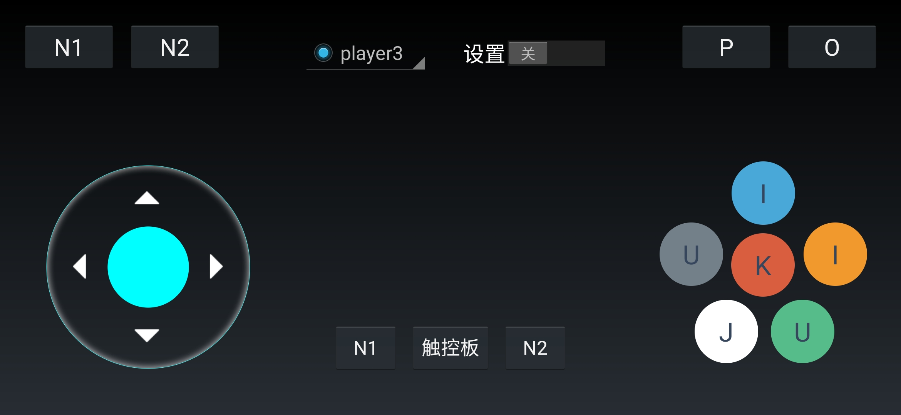
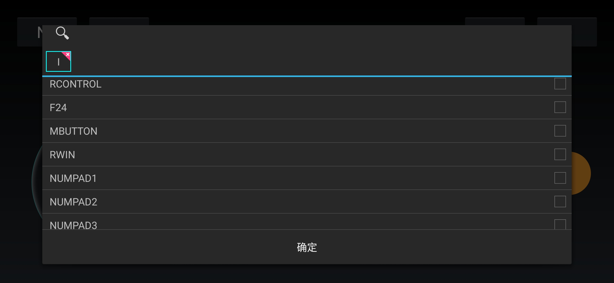
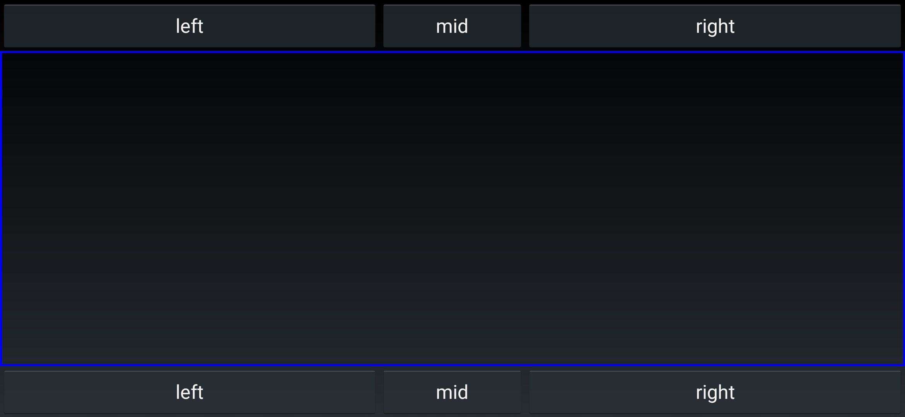
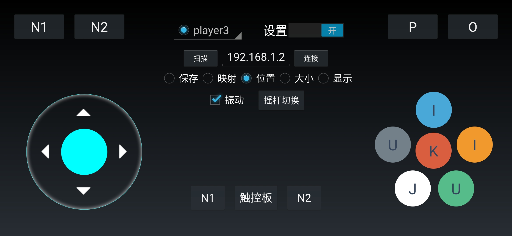

# 安卓虚拟手柄
安卓虚拟游戏手柄，一款将手机变成手柄的软件，支持远程控制电脑，支持多人对战，虚拟触控版，完美支持各种网页游戏，电脑游戏，模拟器游戏，支持mac和windows，快来下载体验吧
相关文件描述：  
pcgmkey 虚拟手柄mac-pc端  
pcgmkey.exe 虚拟手柄windows-pc端  
VgmPad.apk 虚拟手柄安卓端  

启动命令：

PC端启动方式

双击文件启动，或者执行以下命令启动

./pcgmkey

参数说明：服务监听7320端口

